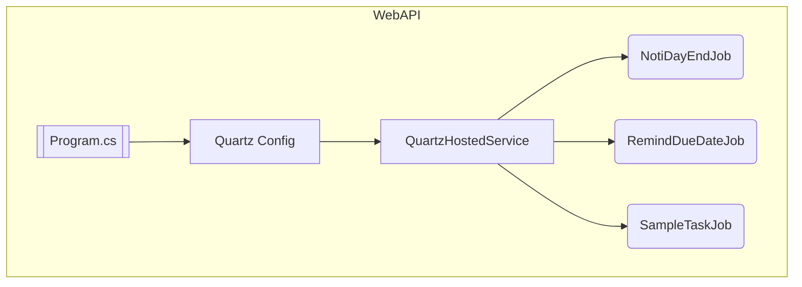

# QuartzBackgroundService &nbsp;  

> **Hands‑on demo** of running **Quartz.NET** jobs as a hosted service in **.NET 9** – perfect template for background scheduling in microservices.

---

## ✨ Key Features

| Area | Details |
|------|---------|
| **Cron‑Driven Jobs** | Three sample jobs (day‑end notification, due‑date reminder, minute task) with expressive CRON triggers |
| **Hosted Service** | Quartz integrated via `AddQuartzHostedService` so jobs survive API restarts |
| **Dependency Injection** | Jobs resolved from DI – easy to inject HttpClient, DB context, etc. |

---

## 🛠️ Tech Stack

- **ASP.NET Core 9** minimal hosting model  
- **Quartz.NET 3.9**   
- **Docker** & **GitHub Actions** for CI

---

## 🗂️ Project Structure



> **Tip:** Replace `CallApiAsync()` inside jobs with your actual HTTP/business logic.

---

## 🚀 Quick Start

```bash
git clone https://github.com/tanapoomjaisabay/QuartzBackgroundService.git
cd QuartzBackgroundService

# Run with .NET
dotnet run --project QuartzBackgroundService

# Or containerize
docker build -t quartz-demo -f Dockerfile .
docker run -p 5000:8080 quartz-demo
```

---

## 🧩 Extending

| How‑to | Snippet |
|--------|---------|
| **Add a new job** | 1. Implement `IJob` → `MyJob` 2. Register trigger in `QuartzServiceExtensions` |
| **Pass config** | Inject `IOptions<MySettings>` into the job constructor |
| **Persist schedules** | Swap to `Quartz.Impl.AdoJobStore` + SQL Server |

---

## 🤝 Contributing

PRs are welcome! Feel free to open issues, suggest refactors, or add new features.

---

## 📜 License

Distributed under the **MIT** license. See `LICENSE` for more info.
